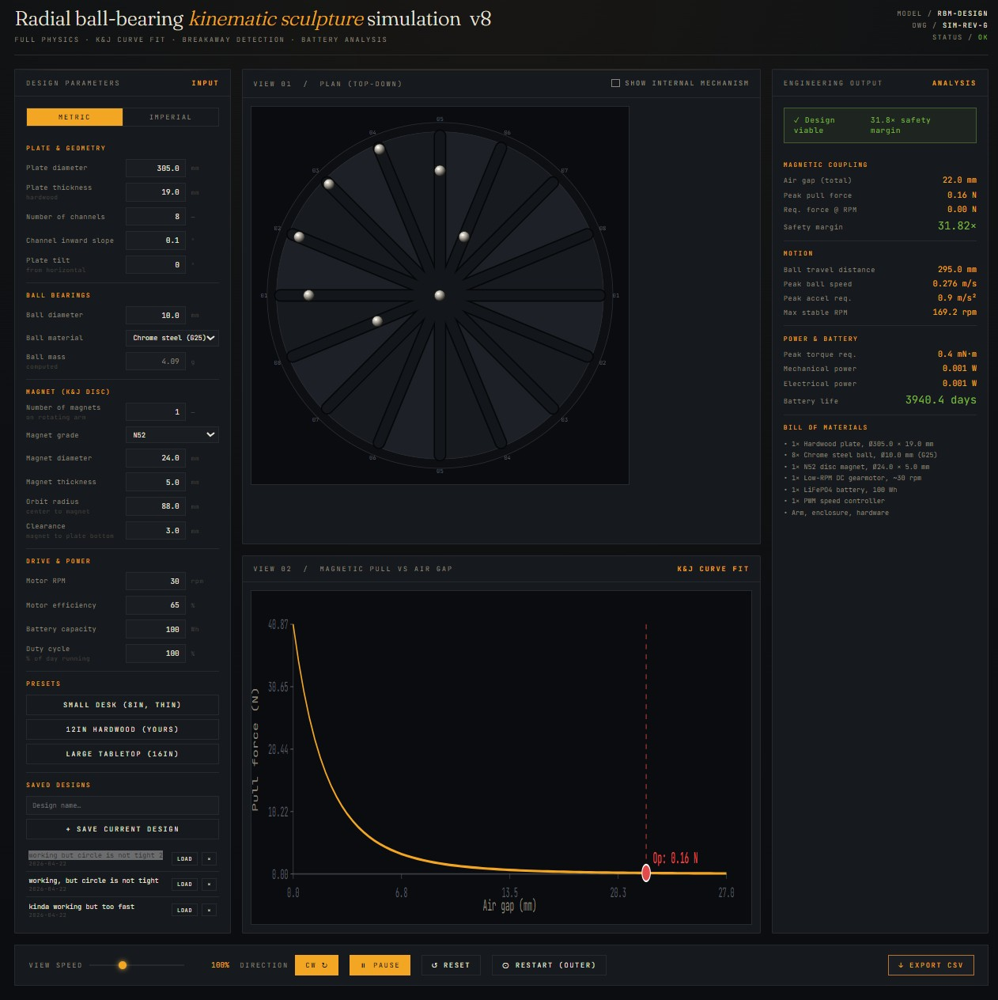

# Radial Ball-Bearing Kinematic Sculpture Simulation

A single-file, browser-based physics design tool for a magnetic ball-bearing kinematic sculpture: a wooden plate with radial channels, a ball bearing in each channel, and a neodymium disc magnet orbiting beneath the plate. As the magnet rotates, it drags each ball to the perpendicular foot of its channel — the eight foot-points together trace a circle whose center itself orbits at half the magnet's radius (Thales' circle).  See it in action here: https://powellga.github.io/ball-bearing-kinematics-simulation/

## The mechanism

- A hardwood plate with `N` full-diameter channels radiating through the center.
- One chrome-steel ball per channel, free to slide along its diameter line.
- A rotating arm beneath the plate carries one or more N-grade neodymium disc magnets at a fixed orbit radius.
- The magnet's in-plane pull projects onto each channel, so each ball's stable equilibrium is at `p = R · cos(θ − φ)` where `R` is the orbit radius, `θ` is the magnet angle, and `φ` is the channel angle.
- Geometry (Thales): all equilibrium points lie on a circle of diameter `R`, whose center rides at radius `R/2`. The eight balls therefore appear as a rotating circle on the plate surface.

## Features

- Full K&J-style pull-force fit with a gap-dependent decay exponent.
- Live analysis panel: peak pull force, required force at RPM, safety margin, max stable RPM, peak ball speed and acceleration, peak torque, mechanical/electrical power, and battery life.
- Battery life exposed both in the output panel and as a computed parameter in the Drive & Power section (switches between hours and days).
- Metric ↔ imperial unit toggle.
- Three built-in presets (8", 12", 16") plus a user preset library: name a design, save it with today's date, load or delete from a list. Stored in `localStorage`.
- `Reset` (balls to center) and `Restart (outer)` (balls to outer ring) controls that don't mutate parameters.
- Adjustable view speed, direction, internal-mechanism overlay, CSV export of ball-position log.

## Running

Open `ballbearing_Kinematic_simulation_v8.html` in any modern desktop browser. No server, no build step, no dependencies beyond two Google Fonts loaded from the CDN.

## Status

Experimental design tool. The simulation is good enough to rank designs against each other and to find parameter windows where the balls lock into clean tracking (magnet thickness and effective channel damping turn out to dominate). It is not a replacement for a prototype.
